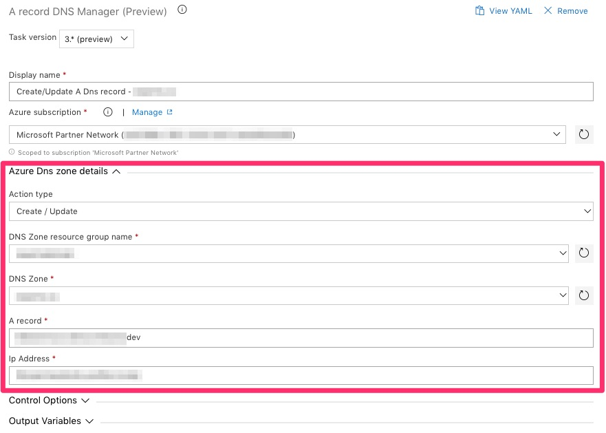
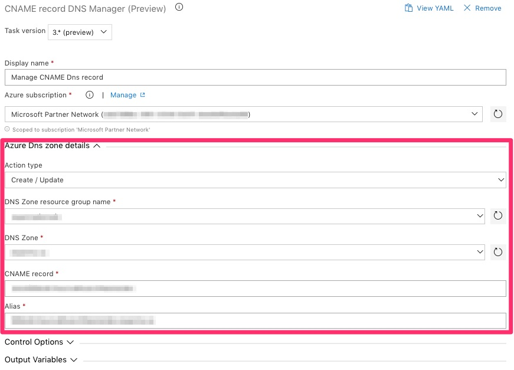

Tasks packages to manage Azure DNS Zone Azure DevOps release pipeline.

Tasks provides:
- A Record Manager
- CName Record Manager

This task package is compatible with:
- Hosted macOS build agent (supported)
- Hosted VS2017 (supported)
- Any private build agent with Powershell and Azure CLI installed

## Builds status
<table>
  <thead>
    <tr>
      <th>Branch</th>
      <th>Status</td>
    </tr>
  </thead>
  <tbody>
    <tr>
      <td>Master</td>
      <td></td>
    <tr>
  </tbody>
</table>

## Release status
<table>
  <thead>
    <tr>
      <th>Release</th>
      <th>Status</td>
    </tr>
  </thead>
  <tbody>
    <tr>
      <td>Public Marketplace</td>
      <td></td>
    </tr>
  </tbody>
</table>

## A Record Manager (required parameters)

## CNAME Record Manager (required parameters)

# Requirements

- Azure CLI must be installed on the build agent
