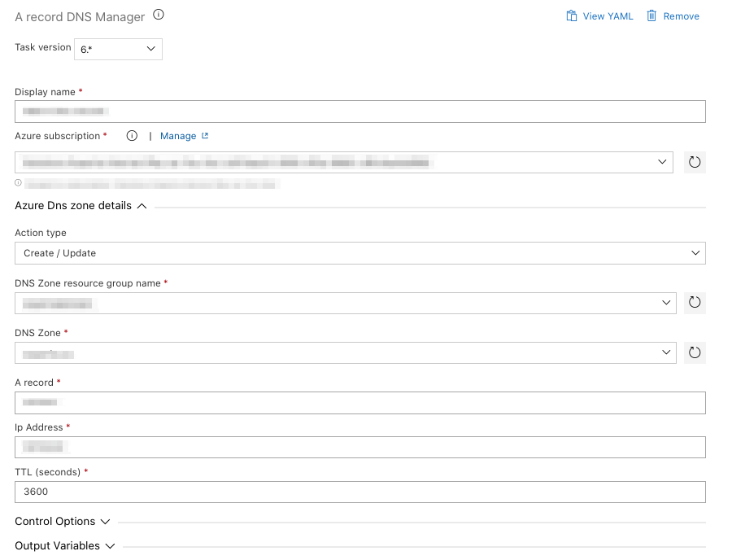
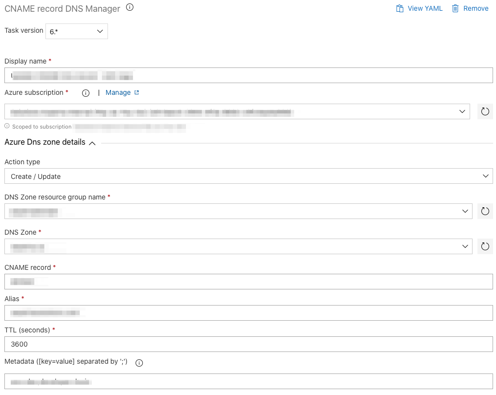
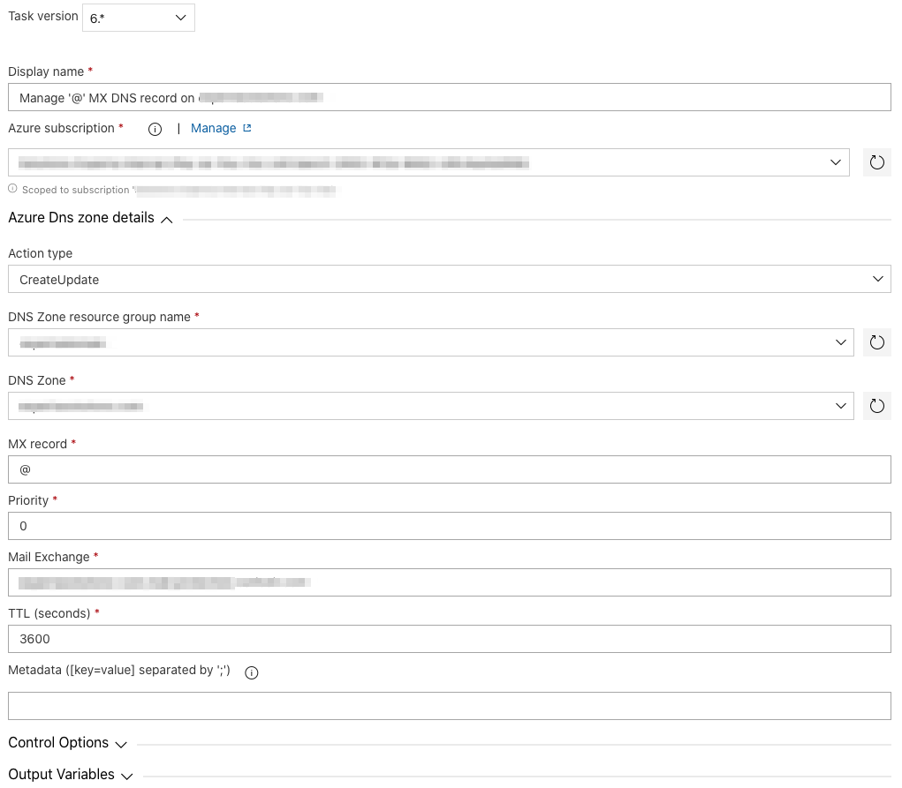
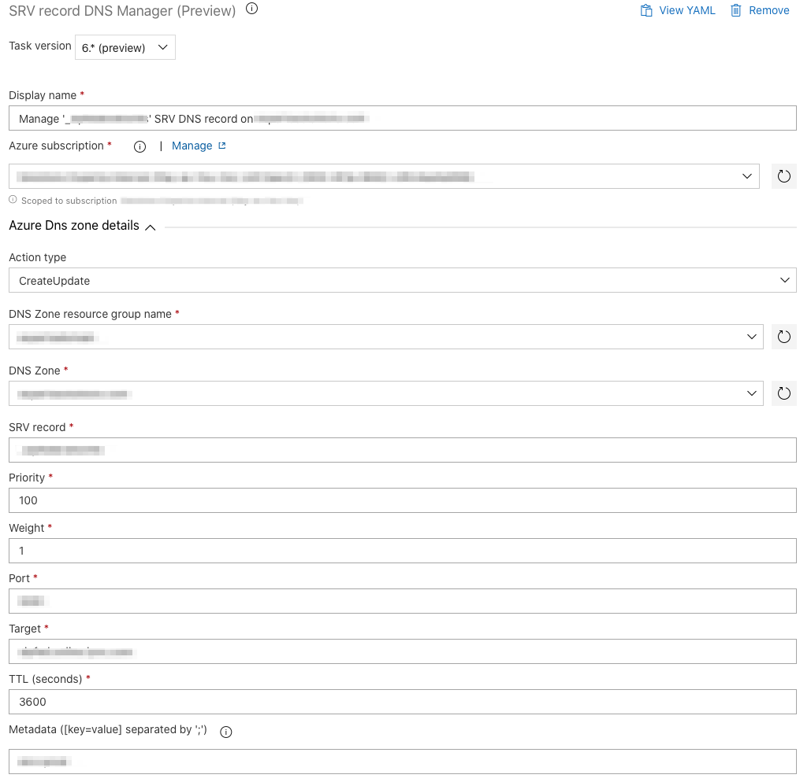
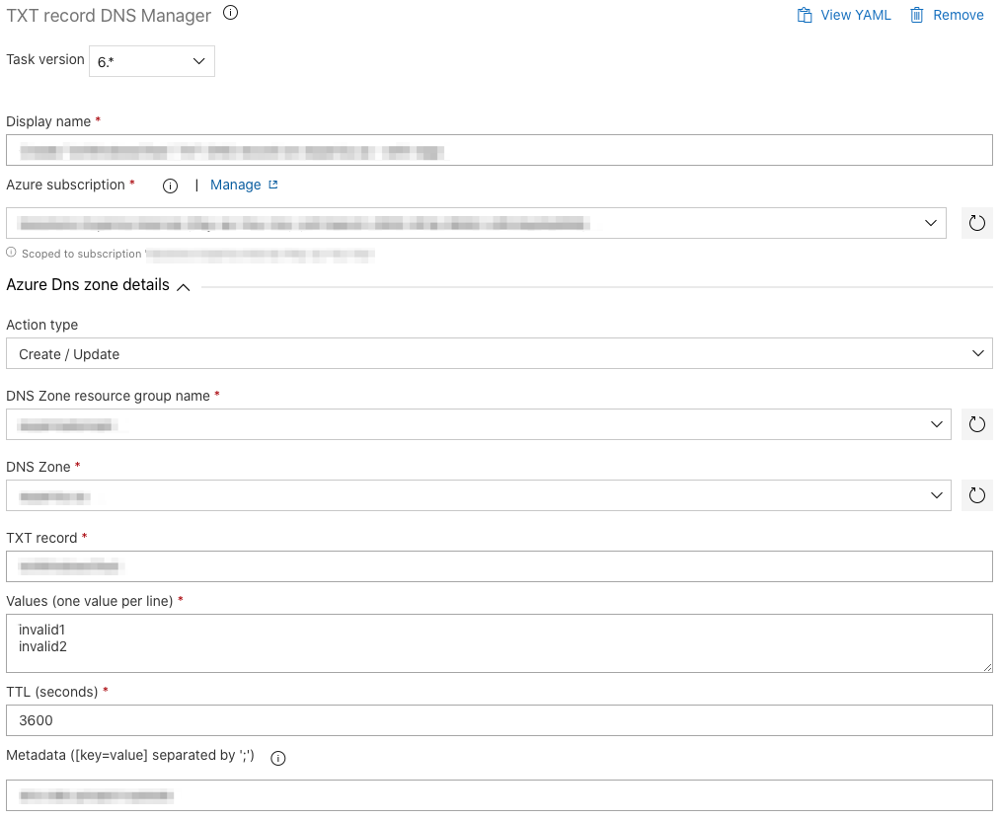

# Objective

Tasks packages to manage Azure DNS Zone from Azure DevOps release pipeline.
Fully compatible with all kind of Azure DevOps build agents.
See ***[Release notes](https://github.com/expertasolutions/AzureDNSZoneExtensions/releases)***

## Available tasks

- ### A Record Manager
  

- ### CNAME Record Manager
  

- ### MX Record Manager
  

- ### SRV Record Manager
  

- ### TXT Record Manager
  