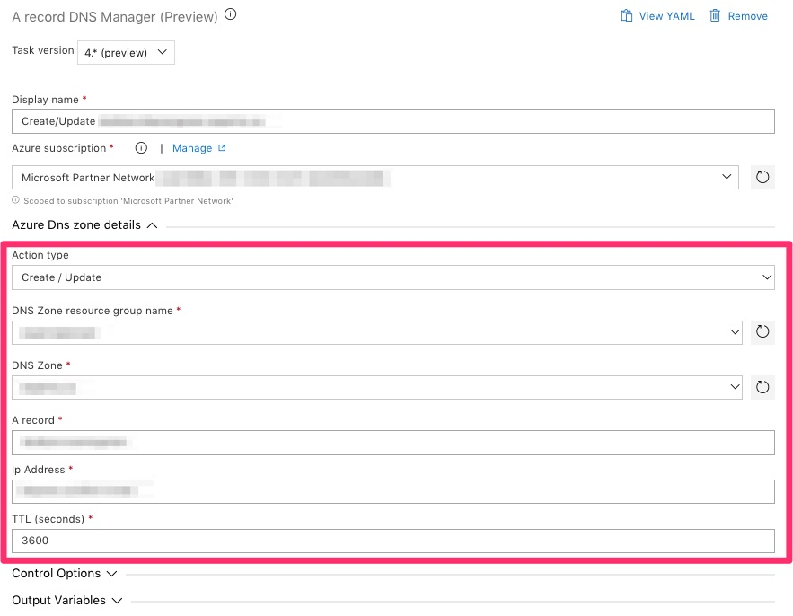
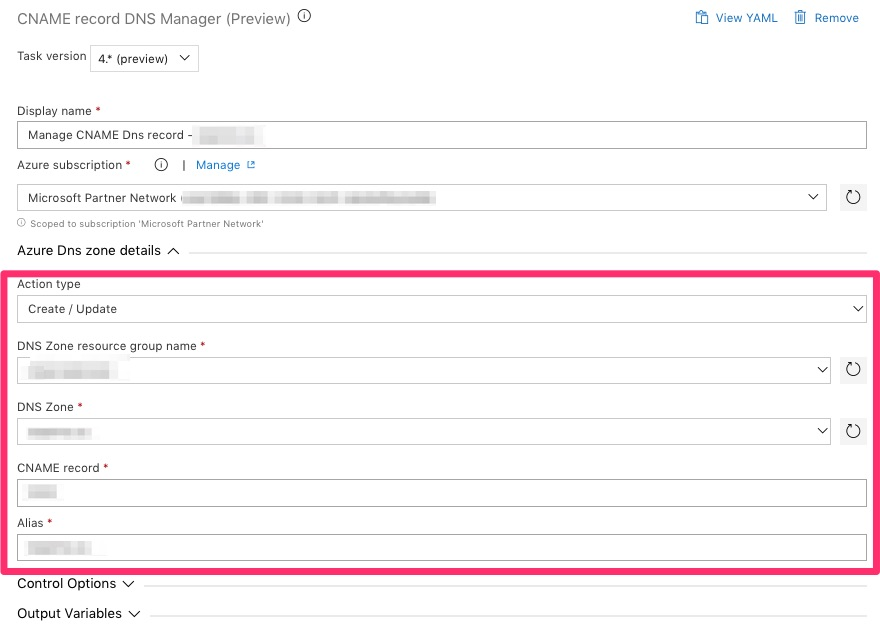

Tasks packages to manage Azure DNS Zone Azure DevOps release pipeline.

Tasks provides:
- A Record Manager
- CName Record Manager

This task package is compatible with:
- Hosted macOS build agent (supported)
- Hosted VS2017 (supported)
- Any private build agent with Powershell and Azure CLI installed

## A Record Manager (required parameters)

## CNAME Record Manager (required parameters)

# Requirements

- Azure CLI must be installed on the build agent
