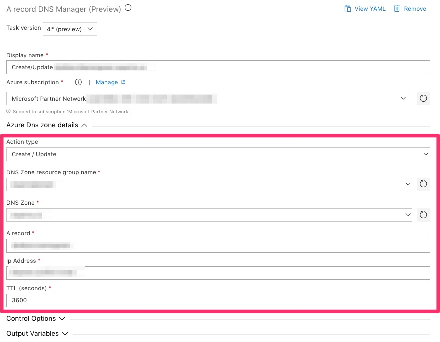
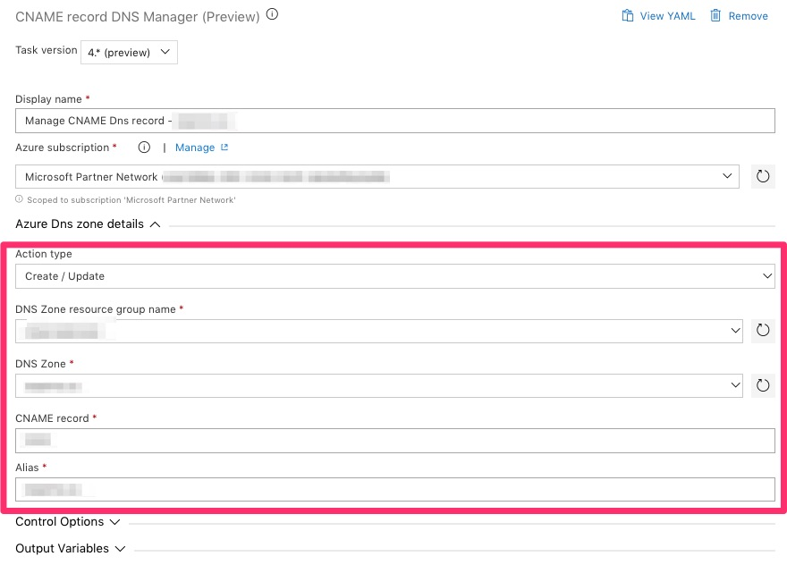

# Objective

Tasks packages to manage Azure DNS Zone Azure DevOps release pipeline.
This packages is compatible with all kind of build agents

## Tasks provides

### A Record Manager (required parameters)

### CNAME Record Manager (required parameters)

