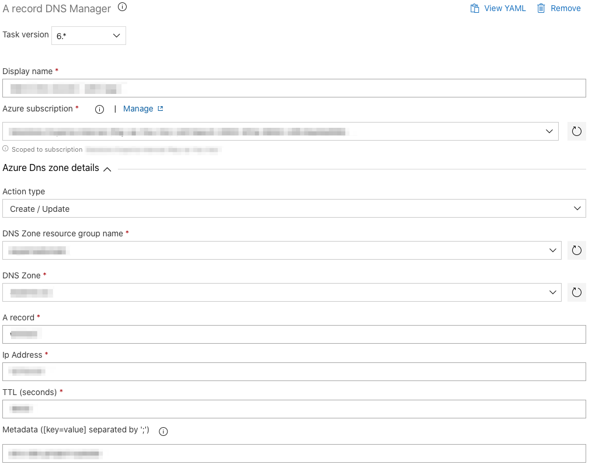

# Objective

Tasks packages to manage Azure DNS Zone Azure DevOps release pipeline.
This packages is compatible with all kind of build agents
See ***[Release notes](https://github.com/expertasolutions/AzureDNSZoneExtensions/releases)***

## Available tasks

- ### A Record Manager
  

- ### CNAME Record Manager
  

- ### TXT Record Manager
  